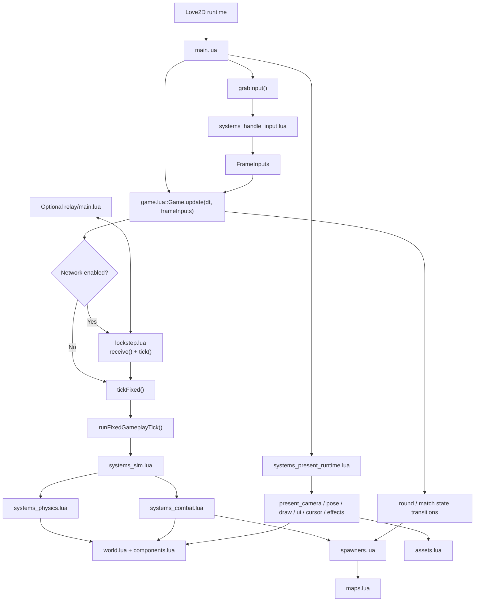
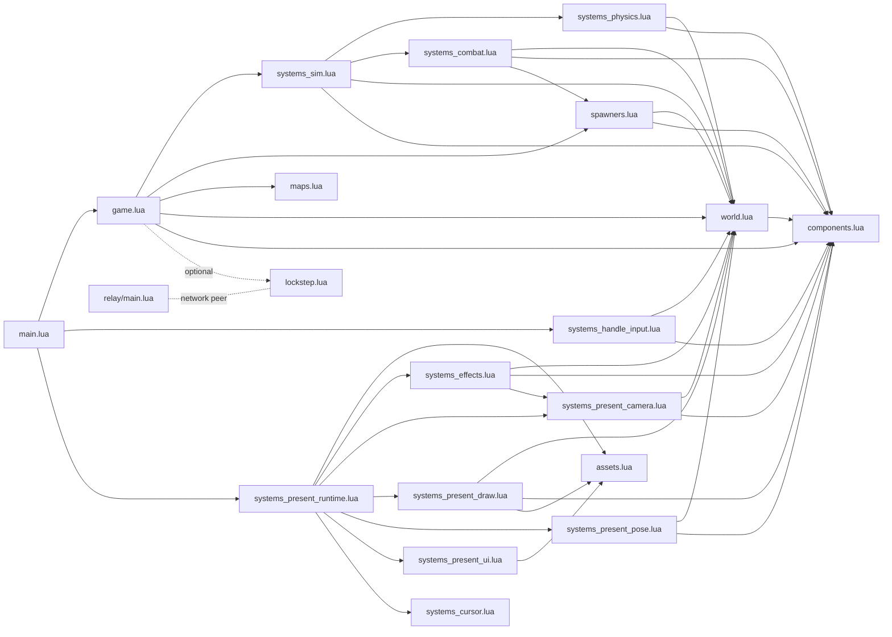

# Architecture

This project is structured around a fairly flat game loop:

1. `main.lua` gathers raw Love2D input.
2. `systems/systems_handle_input.lua` turns that into `FrameInputs`.
3. `game.lua` advances fixed-step game state.
4. `systems/systems_sim.lua` runs simulation systems over the ECS world.
5. `systems/systems_present_runtime.lua` updates and draws presentation state.

The optional networking path inserts lockstep input synchronization before the fixed simulation tick.

## Flow And Layers

## Dependency Overview

## Notes

- `game.lua` is the orchestration layer. It owns round state, match state, fixed-step ticking, and the optional lockstep path.
- `world.lua` and `components.lua` form the ECS foundation used by both simulation and presentation systems.
- `systems/systems_sim.lua` is an ordered pipeline over gameplay systems rather than a deep hierarchy.
- `systems/systems_present_runtime.lua` acts as the presentation coordinator, bundling camera, pose, effects, UI, and drawing.
- `spawners.lua` is shared infrastructure used both for world setup and runtime combat effects like bullets and events.
